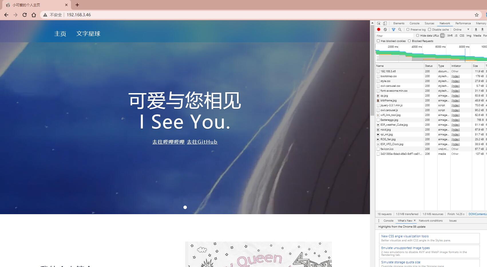
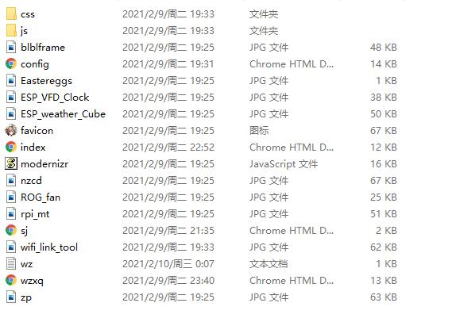

# ESP_WWW
基于esp8266的万维网个人网站模板

 keai.icu  有彩蛋呢！

# 演示及教程视频：https://www.bilibili.com/video/BV1Rr4y1K7FC/
# 相关说明 
* 本项目需要 wifi_link_tool库 
* 需要使用文件系统
* 使用ESP8266 进行建站 仅仅理论证明可信 实测可承受3个客户端同时访问 在20秒内全部加载完毕
* 本项目是娱乐为主，其目的仅仅为实验性证明
* 该项目包含网站中绝大部分请求内容
* 为增加可读性 将所有请求函数独立出来
* 网站中引用的视频为b站up：Devil青酱 的 “一花一世界，一叶一追寻，一曲一场叹，一生为一人。”（BV1wZ4y1W73L）

## 主页

## 文件系统内容

